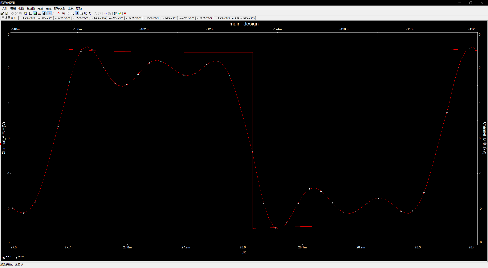

1. NE555 输出1561Hz的方波：
    $$
    f = \frac{1}{\ln(2) \times (R1 + 2 \times R2) \times C}
    $$
    取 C = 0.01 μF,R1 = 1kΩ,R2 = 45.7106kΩ
2. 滤波产生1次，3次，5次谐波：
    1次谐波使用[ButterWorth](LowpassFilter-2ndOrderButterworth.pdf)低通滤波器(增益为1)
    3,5次谐波使用[DABP](mt-209_cn_DABP.pdf)带通滤波器(增益为1)
    
    然后对各次输出进行适当移向，使其相位与方波一致
    得到
3. 将各次谐波使用同向放大器相加，得到合成波形(无负载).
    得到
4. 对3中合成波形进行 先反向积分后反向放大，使Vpp=8V(无负载)
    得到