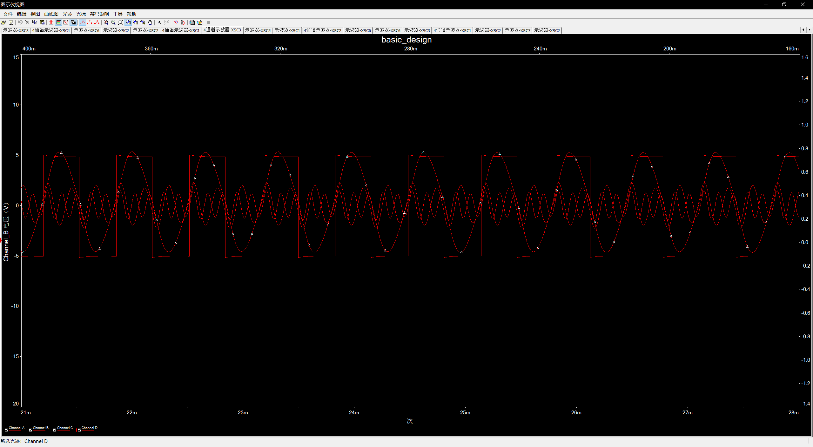
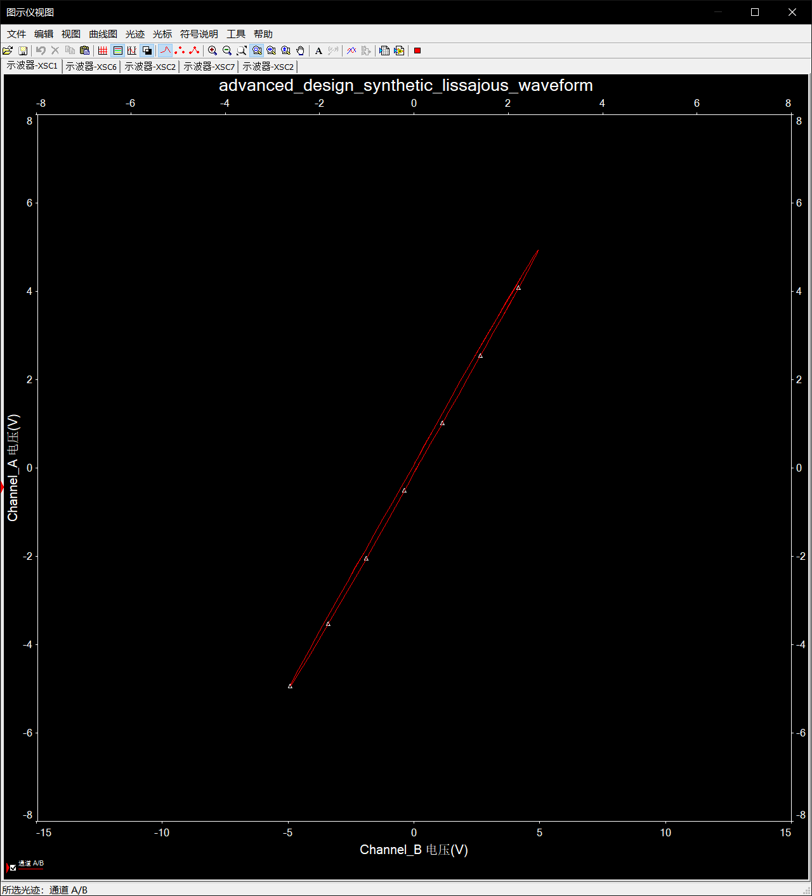
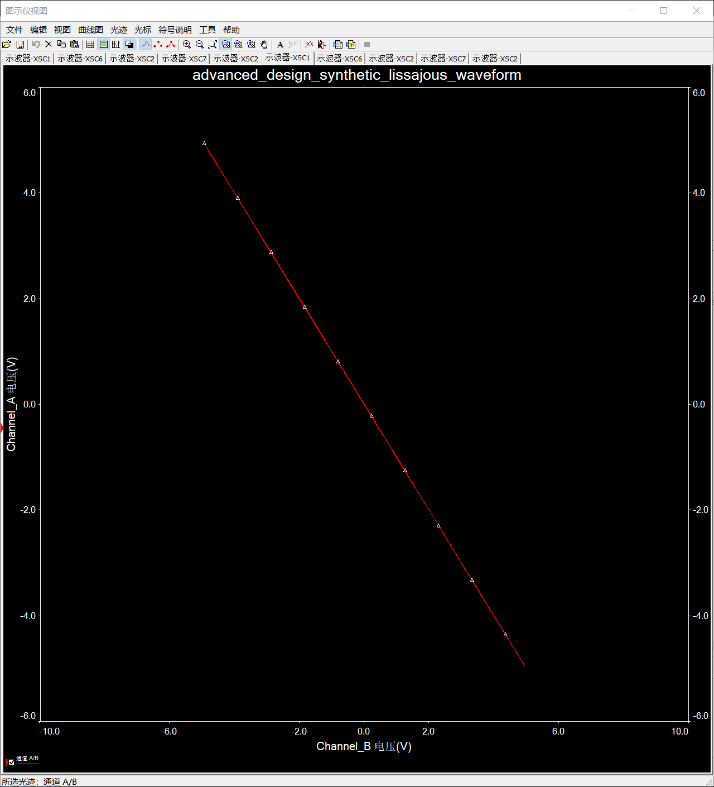

1. NE555 输出1561Hz的方波：
    $$
    f = \frac{1}{\ln(2) \times (R1 + 2 \times R2) \times C}
    $$
    取 C = 0.01 μF,R1 = 1kΩ,R2 = 45.7106kΩ
2. 对方波滤波产生1次，3次，5次谐波：
    1次谐波使用[ButterWorth](LowpassFilter-2ndOrderButterworth.pdf)低通滤波器(增益为1)
    3,5次谐波使用[DABP](mt-209_cn_DABP.pdf)带通滤波器(增益为1)
    
    然后对各次输出进行适当移向，使其相位与方波一致
    得到
3. 将各次谐波使用同向放大器相加，得到合成方波.
    得到
4. 对3中合成波形进行 先反向积分后反向放大，使Vpp=8V
    得到
5. 合成李沙育波形:
    使用方波产生模块+基波ADBP模块+向后(0-180°)的移相模块
    使用20k和1G两个滑动变阻器串联控制移向角度
    接入电阻值实际是Max * (1-percent)
    20k: 100% 1G: 100% 移相0°
    
    20k: 80% 1G: 100% 移相45°
    
    20k: 50% 1G: 100% 移相90°
    
    20k: 20% 1G: 100% 移相135°
    
    20k: 0% 1G: 0% 移相180°
    